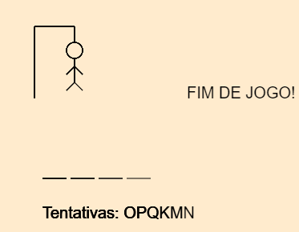
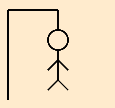
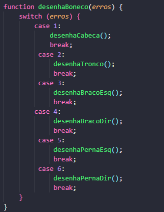
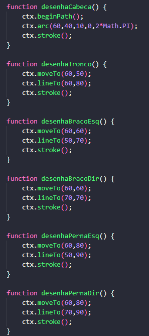
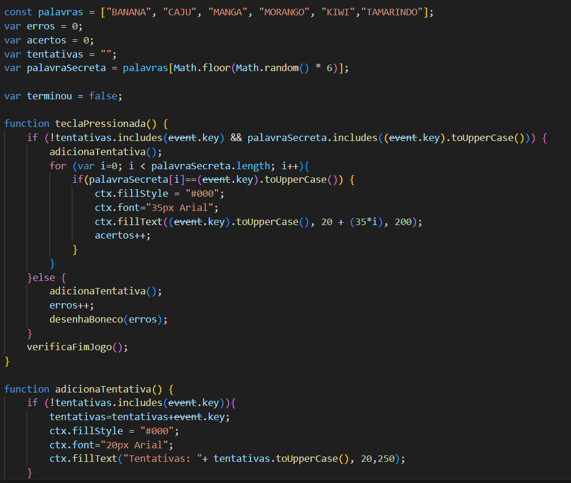
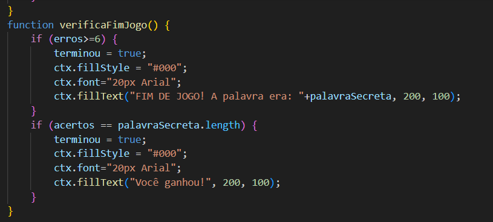
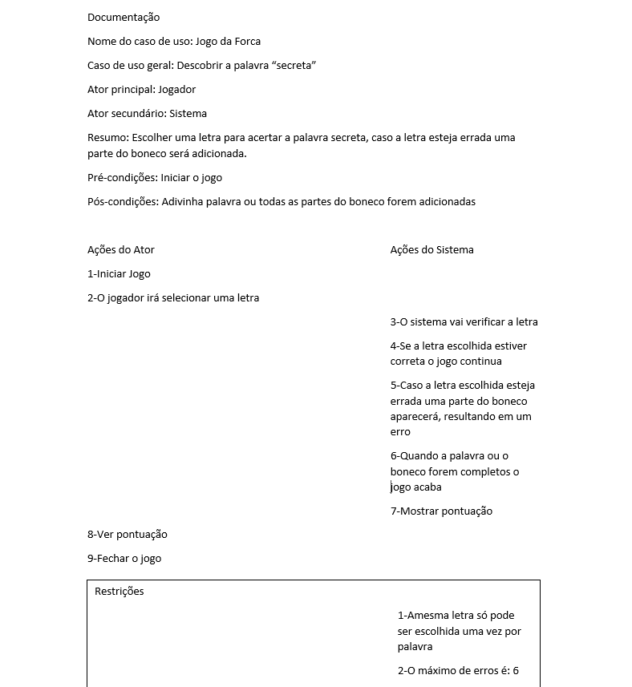
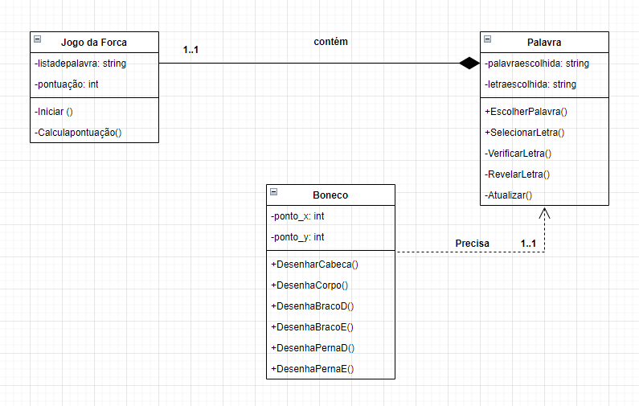
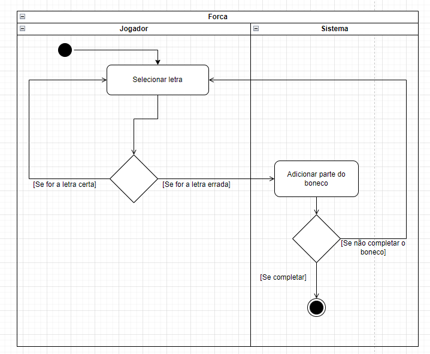

# JogoForca
Carlos Alarcon e Gustavo Henrique

# Sobre o jogo
Criamos um jogo da forca, baseadas em frutas que se vê na feira.  

tem 6 palavras secretas que mudam toda vez que se reinicia a pagina. 

# Explicação
<h1>Como fizemos o boneco</h1>
 
 
 
Esses codigos, contem o desenho do boneco, e tambem para mostrar cada parte dele a cada erro.

<h1>Script do jogo</h1>

 

De começo temos um array chamado "palavras" é definido com algumas palavras-chave para o jogo da forca. 
Temos tambem algumas variaveis para determinar erros, acertos e mais importante, a var "palavraSecreta" que escolhe uma das palavras-chave para ser a escolhida.
Agora a função "teclaPressionada" ela verifica se a tecla pressionada não está nas tentativas e se a palavra secreta contém a letra e adiciona a tentativa.
Se a letra estiver correta, desenha a letra na posição correta na tela e incrementa os acertos, mas a letra estiver incorreta, incrementa os erros e desenha a parte correspondente do boneco da forca.
Chama verificaFimJogo() para verificar se o jogo terminou. 
E a função "adicionaTentativa" adiciona a tecla pressionada às tentativas se ainda não estiver lá e atualiza a exibição das tentativas na tela.

 
Verificação de derrota:
Se o número de erros atingir 6, o jogador perdeu. A variável terminou é definida como verdadeira, indicando que o jogo terminou.
Uma mensagem é exibida na tela informando que o jogo terminou e qual era a palavra secreta.
 
Verificação de vitória:
Se o número de acertos for igual ao comprimento da palavra secreta (palavraSecreta.length), o jogador adivinhou todas as letras corretamente. Isso significa que o jogador ganhou o jogo e uma mensagem de vitória é exibida na tela.

# Diagramas
 
 
 
 